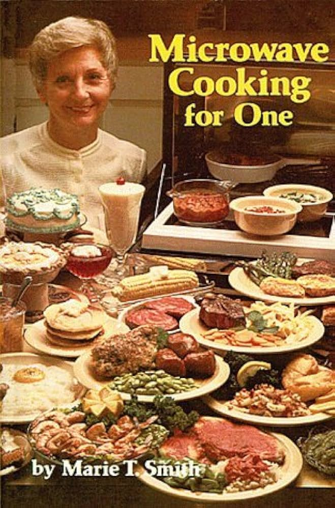

# The Microwave.

The world's most advanced free digital Microwave!

By: Andrew Blakey

## FAQ

### Q: Why?

Because Microwaves these days usually aren't free.

### Q: No. Seriously. Why?

See above.

### Q: When I turn the sound off, the beeps stop, but the microwave sound also goes away. That's not realistic.

That's a feature of this microwave and is why it is used and loved by millions.

### Q: Any recipe suggestions?

I enjoy the Pop Tarts. But be sure to check out this book:

### Q: A thing isn't implemented cleanly. It's not DRY. It won't scale.

This project is for *fun*.

### Q: How did you get the 7 Segment Display to work so nicely?

I used this font, which is absolutely amazing: https://www.keshikan.net/fonts-e.html

### Q: How does the whole thing scale so elegantly?

[Container Queries!](https://developer.mozilla.org/en-US/docs/Web/CSS/CSS_container_queries) I love them. They make it easy to scale a font based on the local parent rather than the window width.

### Q: Why didn't you use a finite state machine? This is a classic FSM.

How about you implement a FSM in TypeScript for a toy project and tell me you're still having fun.

But seriously, yes, if this was an actual project, that's a good idea. Given this is a very shallow machine, basic conditional logic is actually much less work, even if it's a bit repetitive.  There are no wacky side-effects or exception cases to worry about: you read a `doSomething` function and know exactly what it does.

## Important Links

- [Microwaving Airbags](https://www.youtube.com/watch?v=RhjHAPw1q-M)

- [Antique Microwaves](https://www.youtube.com/watch?v=UiS27feX8o0)
